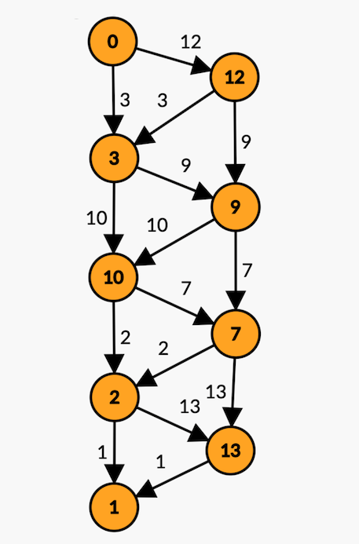

'Jump It' is a one-player game with a linear board of boxes. Each box contains a positive integer (except the first box, which always contains 0). The player begins in the first box, and must land in the last box with the least score. The integer in each box is cost to enter that box. Each turn, the player may make one of two moves: they may proceed to the adjacent box or jump the adjacent box, landing in the subsequent box. The player may only move forward, never backward.

Letting the boxes be vertices and the possible moves from one box to another be edges, any Jump It board can be represented as a weighted, directed graph. The graph for the board [0, 12, 3, 9, 10, 7, 2, 13, 1], is shown below.

Since no backwards moves are allowed, there are no cycles in the graph of any Jump It board. Hence, every Jump It board is a directed acyclic graph (DAG). All DAGs have at least one topological ordering, and the ordering for every Jump It board is the list of vertices from first to last. This means that we can use edge relaxation to find the minimum score for any board.

'Jump It' is the name given to this game by Walter Savich in _Problem Solving with C++_, 9th edition.
